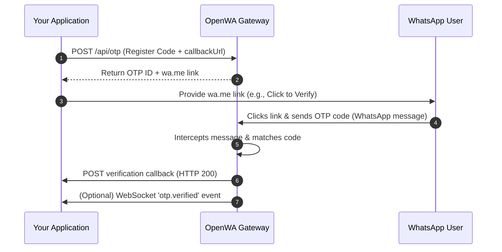

# OpenWA OTP Verification Service Guide

The **OTP (One-Time Password) Verification Service** allows your backend application to register, monitor, and automatically verify OTP codes sent by users via WhatsApp.

---

## ⚙️ How it Works



1. **Registration:** Your app registers a code (4-6 digits) for a user's phone number on an active WhatsApp session using `POST /api/otp`.
2. **Action Link:** The API returns a direct `wa.me` WhatsApp link prepopulated with the code.
3. **Transmission:** The user clicks the link and sends the WhatsApp message.
4. **Auto-Verification:** The OpenWA engine intercepts the incoming message, matches the code, and marks the OTP status as `verified`.
5. **Callback Notification:** OpenWA delivers the status update directly to your application's `callbackUrl`.

---

## 🔑 Authentication

All requests to the API endpoints require your API key in the headers:

* **Header Name:** `X-API-Key`
* **Value:** `owa_k1_your_api_key_here`

---

## 📡 API Reference

### 1. Register a new OTP Verification
* **Method:** `POST`
* **Endpoint:** `/api/otp`

#### Request Body
| Field | Type | Required | Description | Example |
| :--- | :--- | :---: | :--- | :--- |
| `phone` | `string` | Yes | Target phone number (must be in E.164 format) | `"+1234567890"` |
| `code` | `string` | Yes | Verification code (4-6 digits) | `"4821"` |
| `sessionId` | `string` | Yes | Active session name to receive the message | `"session-adel"` |
| `callbackUrl` | `string` | No | URL to POST the verification result to | `"https://app.com/api/otp-callback"` |
| `callbackSecret`| `string` | No | Secret key for signing the callback payload | `"my-secret-key"` |
| `expiresIn` | `integer`| No | Expiry time in seconds (Default: `120`, Min: `30`, Max: `600`) | `120` |

#### Request Example (cURL)
```bash
curl -X POST http://whatsapp.edu-lens.com/api/otp \
  -H "Content-Type: application/json" \
  -H "X-API-Key: owa_k1_your_api_key_here" \
  -d '{
    "phone": "+1234567890",
    "code": "4821",
    "sessionId": "session-adel",
    "callbackUrl": "https://app.com/api/otp-callback",
    "callbackSecret": "my-secret-key",
    "expiresIn": 120
  }'
```

#### Response Example (201 Created)
```json
{
  "id": "e458b0f1-4db5-4fa0-82a5-eb72b0c1aa32",
  "phone": "+1234567890",
  "status": "pending",
  "expiresAt": "2026-07-13T10:02:00.000Z",
  "whatsappLink": "https://wa.me/201273809805?text=4821",
  "createdAt": "2026-07-13T10:00:00.000Z"
}
```

---

### 2. Check OTP Status
Use this to manually poll the status of an OTP.
* **Method:** `GET`
* **Endpoint:** `/api/otp/:id`

#### Response Example (200 OK)
```json
{
  "id": "e458b0f1-4db5-4fa0-82a5-eb72b0c1aa32",
  "phone": "+1234567890",
  "status": "verified",
  "expiresAt": "2026-07-13T10:02:00.000Z",
  "verifiedAt": "2026-07-13T10:00:45.000Z",
  "createdAt": "2026-07-13T10:00:00.000Z"
}
```

---

### 3. Cancel an OTP Verification
Cancels a pending OTP registration.
* **Method:** `DELETE`
* **Endpoint:** `/api/otp/:id`

#### Response (204 No Content)
*Returns success with no body.*

---

### 4. List OTP Logs
Provides a historical log of OTP verifications.
* **Method:** `GET`
* **Endpoint:** `/api/otp`
* **Query Parameters:**
  * `status`: filter logs by status (`pending`, `verified`, `expired`, `cancelled`, or `all`)
  * `limit`: number of records to return (Default: `50`)
  * `offset`: offset for pagination (Default: `0`)

---

## 🔄 Callback Integrations (Webhook)

If you configured a `callbackUrl` when registering the OTP, OpenWA will send a `POST` request to your server when the status changes.

### Callback Payload Example (Successful Verification)
```json
{
  "id": "e458b0f1-4db5-4fa0-82a5-eb72b0c1aa32",
  "phone": "+1234567890",
  "verified": true,
  "verifiedAt": "2026-07-13T10:00:45.000Z"
}
```

### Callback Payload Example (Expiry/Cancellation)
```json
{
  "id": "e458b0f1-4db5-4fa0-82a5-eb72b0c1aa32",
  "phone": "+1234567890",
  "verified": false,
  "reason": "expired" // or "cancelled"
}
```

---

## 🔒 Callback Security (HMAC Signature)

If you provided a `callbackSecret` during registration, OpenWA signs the callback payload using a SHA-256 HMAC signature. 

Your application should verify this signature to ensure the webhook came from OpenWA.

* **Header Present:** `X-OTP-Signature`
* **Format:** `sha256=<signature_hex>`

### Verification Example (Node.js/Express)
```javascript
const crypto = require('crypto');

function verifyOtpCallback(req, secret) {
  const signatureHeader = req.headers['x-otp-signature'];
  if (!signatureHeader) return false;

  const [algorithm, signature] = signatureHeader.split('=');
  if (algorithm !== 'sha256') return false;

  const rawBody = JSON.stringify(req.body);
  const expectedSignature = crypto
    .createHmac('sha256', secret)
    .update(rawBody)
    .digest('hex');

  return crypto.timingSafeEqual(Buffer.from(signature), Buffer.from(expectedSignature));
}
```
